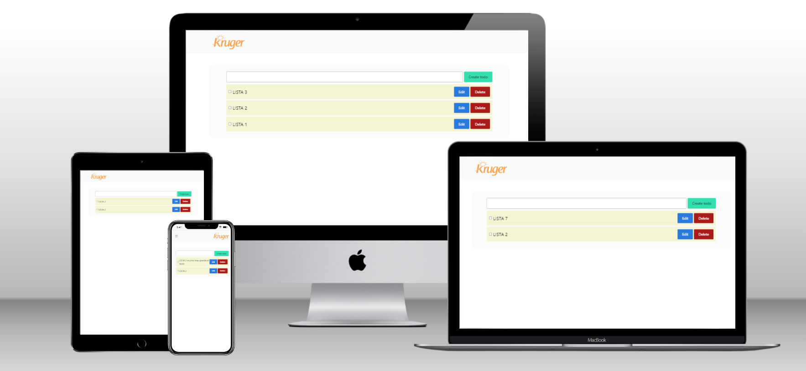

# Kruger Star Using the State Hook - React.js

> Portfolio project

## Built with 

- JavaScript
- React.js 18
- React Bootstrap
- Netlify 
- HTML + CSS

## Live Demo

[Live demo link](https://kruger-star-playground-dc.netlify.app/)

## Run it locally

 ### Setup

 - Clone this repo using `git clone https://github.com/DaniCis/TallerRouting_Kruger`

 ### Commands

 - `npm i`
 - `npm start`

## Author

👤 **Ariel Piguave**

- GitHub: 
- Twitter: 

## 🤝 Contributing

- Juan Sotomayor - Tutor Kruger Star

## Show your support

Give a ⭐ if you like this project!

## Acknowledgments

- Design by: JS

## 📝 License

This project is [MIT](./MIT.md) licensed.

